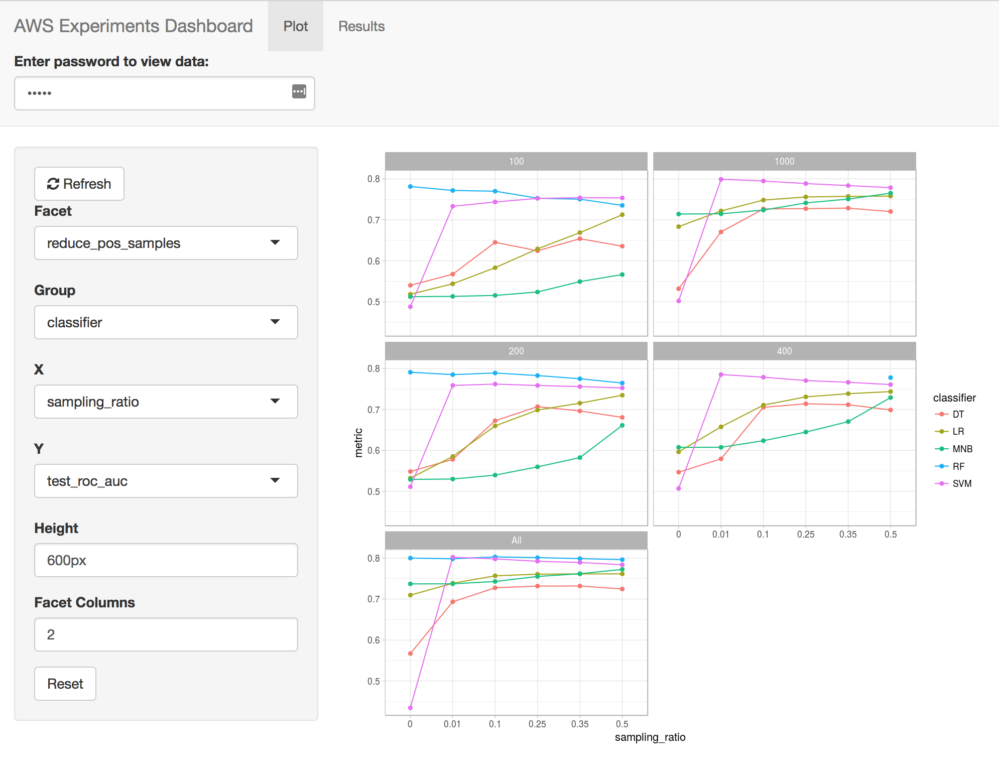

# aws-ml-experimenter

This project contains scripts to run ML experiments on AWS EC2 instances fairly seamlessly.

Prerequisites:

* AWS account and credentials configured locally
* .pem file for SSH-ing onto your EC2 instances
* IAM role with S3 access to your bucket, must be named "ec2_role"
* The AWS user must have EC2 and S3 permissions, along with IAM Pass Role (see below) for spinning up instances with access to S3

Make sure the .pem file is named exactly the same as the key name on your AWS account. The experiment scripts assume the names are the same. If your key is called "mykey" on your AWS account, then the pem file should be called "mykey.pem".

Use the `--bid-price` flag to take advantage of SPOT instances and save money!

IAM pass role policy:

```
{
    "Version": "2012-10-17",
    "Statement": [{
        "Effect": "Allow",
        "Action": "iam:PassRole",
        "Resource": "*"
}]
}
```

Example notebooks:

* Data prep: [medicare-data.ipynb](https://github.com/rikturr/aws-ml-experimenter/blob/master/examples/medicare-data.ipynb)
* Scikit-learn (Random Forest): [scikit-learn.ipynb](https://github.com/rikturr/aws-ml-experimenter/blob/master/examples/scikit-learn.ipynb)
* Keras (Multilayer Perceptron): [keras.ipynb](https://github.com/rikturr/aws-ml-experimenter/blob/master/examples/keras.ipynb)

## Jupyter notebooks

To run a jupyter notebook from an EC2, run the `experiments/jupyter.py` file:
 
`python experiments/jupyter.py <MY PEM> --instance-type m4.large`

This will spin up an EC2 instance of your choosing and give you the command to create a tunnel to your local machine. Once you launch Jupyter from the EC2 instance, you can access it from http://localhost:8000. You will need the token presented from the EC2 instance when launching the jupyter notebook to be able to login.

There are several example notebooks in the `examples` folder.

## Experiments

To make sure your AWS account is setup properly, run the test experiment:

`python experiments/run_experiment.py experiments/test.py examples/test_config.py <PEM> <BUCKET> --instance-type m4.large`

This should create a log file on your S3 bucket printing out "Hello world!" at the end.

To launch long-running experiments, there are some experiments set up:

* `experiments/classification_sklearn.py`: scikit-learn 
* `experiments/classification_tpot.py`: [TPOT](https://github.com/EpistasisLab/tpot) with scikit-learn 
* `experiments/classification_keras.py`: Keras models. Note that you should use a GPU instance type when running keras models.

Example configurations for these experiments (along with code to run them) are in the `examples/tpot_medicare.py` and `examples/keras_medicare.py` files.

## Dashboard

A Shiny project is in the `dashboard/` folder than can visualize the results of the experiments, using the result files saved to S3.




## Guided walkthroughs

### Miami Machine Learning meetup

This repo was presented in a talk titled "Machine learning in the cloud with Amazon Web Services" for the Miami Machine Learning Meetup group: https://www.meetup.com/Miami-Machine-Learning-Meetup/events/246682816/

* Slides: https://github.com/rikturr/aws-ml-experimenter/blob/master/examples/aws_intro.pdf
* Video: https://youtu.be/JIasG2DfDVc